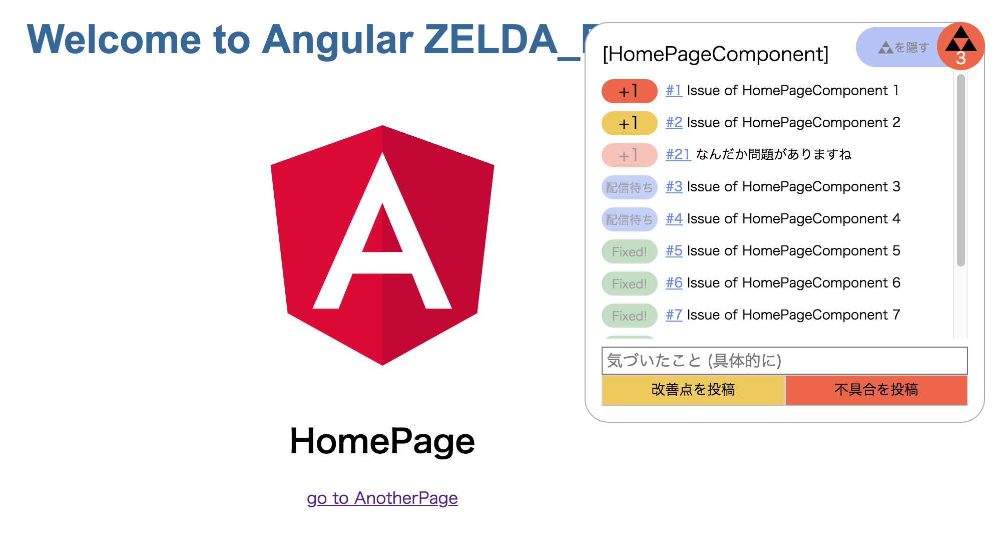

# angular-zelda


## Run Sumple Project
```
npm install
npm run serve
```

## How to ZELDA_ERROR for Angular
app.component.ts, app.component.html を参照してください。

routerの変更(<router-outlet>のonActivateイベント)を検知し、
描画対象のコンポーネント名をconstructor.nameで取得してsituationを切り替えています。
