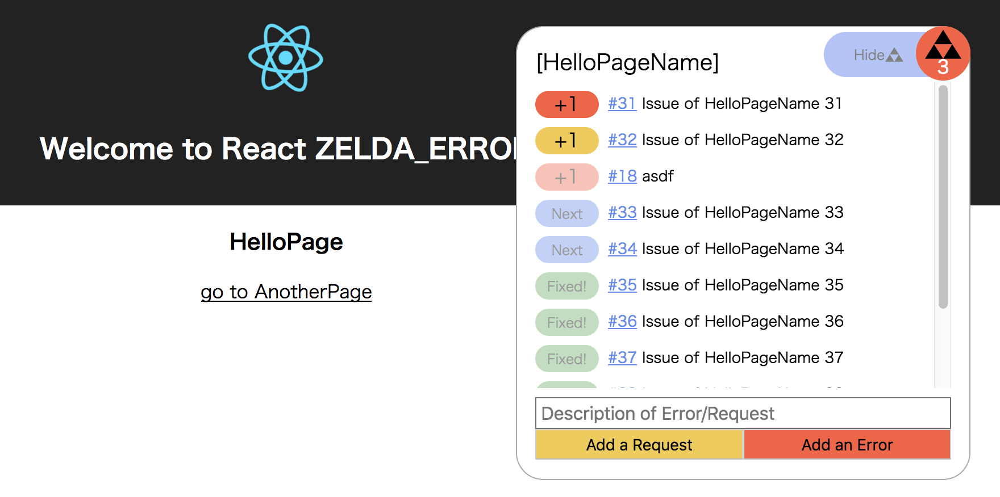

# react-zelda


## Run Sumple Project
```
npm install
npm start
```

## How to ZELDA_ERROR for React
RouterRoot.tsx を参照してください。  

現在のpath(location.pathname)とpathが一致するrouterの定義を探し、  
その名前をsituationとして切り替えています。  
もっとスマートな方法でやりたいんだけどなかなかできなくて。
